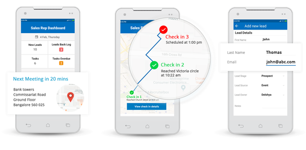
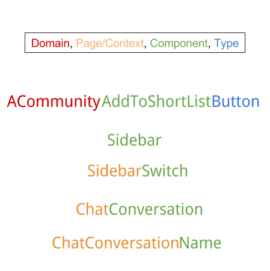

# ERDV-V2

`make install`  
Builds dev container. 

`make start`  
1. Starts dev container in background.  
2. Automatically opens project in chrome [http://localhost:3000](http://localhost:3000)

The page will automatically reload if you make edits. 

`make openwsdoc`  
Opens Culligan specific Optitime API documentation

## Contacts
| Interne : Expert métier - équipe Service | Externe : Contact Optitime / Geoconcept |
|---------------------------------------------------|-------------------------------|
| Alan Louyer | Lise Vilcocq |
| louyera@culligan.fr | lise.vilcocq@geoconcept.com |
| +33 (0)1 30 16 23 23 | +33 (0) 2 31 46 92 39 |
| | +33 (0) 6 09 27 55 97 |

## Practices that have to be followed in the code
- make sure to properly update the dependencies for each react hook, otherwise it can break your code and receive TS Internal Errors
- 

## Optitime Requests: How does it work?

ERDV works using data coming from Optitime.  
XML requests are made to Optitime webservices to get these data.  
For any request to succeed, there is a process to follow:  

Each data request must happen after a `checkConnexion` request which is used to authenticate/login.
Then we can proceed further and launch other types of requests.

ex:
To get data from a `submitRequests` XML request, you need to do:  
- `checkConnexion` -> `submitRequests`  
> using `submitRequests` endpoint directly does not work

## Access Optitime API documentation
- Standard Optitime API doc (VPN connection needed outside VSQ):  
http://vsqoptrf/opt-ffa-connector-services_culligan/doc/doc/list.html

- Culligan specific Optitime API doc:  
`make openwsdoc`

## Libraries used in this project

[google-libphonenumber](https://github.com/ruimarinho/google-libphonenumber) - to validate phone numbers  
[await-to-js](https://github.com/scopsy/await-to-js) - write async await without try-catch blocks in Javascript ([article](https://blog.grossman.io/how-to-write-async-await-without-try-catch-blocks-in-javascript/))  
[react-use](https://github.com/streamich/react-use) - brings extra [react hooks](https://reactjs.org/docs/hooks-intro.html), among these [useMount](https://github.com/streamich/react-use/blob/master/docs/useMount.md) and [useEffectOnce](https://github.com/streamich/react-use/blob/master/docs/useEffectOnce.md) have been used in this project  
lodash (lodash.isNil, lodash.isEmpty, lodash.values, lodash.every)  
react-router-dom - for the routing  
react-ga - Google Analytics for React  
react-loading-skeleton - for loading google-like  
react-hook-form - form handling  

## Vocabulary

**FFA = Field force automation**  
Among all the sales teams (inside sales, pre-sales, call center, sales development), the field force is the hardest to control – because you are not with them physically. As your field sales reps move from one prospect to the other, you want to know what’s happening with every meeting. You don’t want to wait for the meeting to get over and then call the rep each time and ask “What happened. how did it go”

Field force automation solves this challenge by establishing a real-time communication channel between the off-site sales team and the onsite team handling sales and admin operations.

## Useful articles used for this project

### React
- [React components naming convention](https://medium.com/@wittydeveloper/react-components-naming-convention-%EF%B8%8F-b50303551505)
  

### How to setup Docker

- [Dockerizing a React App](https://mherman.org/blog/dockerizing-a-react-app/)

- [NodeJS: Making docker-compose Volumes Ignore the node_modules Directory](https://medium.com/@semur.nabiev/how-to-make-docker-compose-volumes-ignore-the-node-modules-directory-99f9ec224561)

- [How to separate your architecture in several autonomous services with Docker](https://blog.bam.tech/developer-news/dockerize-your-app-and-keep-hot-reloading)

### Understanding Typescript

Interface vs Type
- https://pawelgrzybek.com/typescript-interface-vs-type/
- [in TypeScript 2.7](https://medium.com/@martin_hotell/interface-vs-type-alias-in-typescript-2-7-2a8f1777af4c)

Others
- [Typing Destructured Object Parameters in TypeScript](https://mariusschulz.com/blog/typing-destructured-object-parameters-in-typescript)

### Miscellaneous

- [How to show rendering updates in Chrome DevTools](https://www.codebeast.dev/usestate-vs-useref-re-render-or-not/#we-forget-to-account-for-nested-components)
- [Everything you need to know about Loading Animations](https://medium.com/flawless-app-stories/everything-you-need-to-know-about-loading-animations-10db7f9b61e) - history of loading from gif loaders to skeleton screens
- [Implementing Skeleton Screens In React](https://www.smashingmagazine.com/2020/04/skeleton-screens-react/)

## To consider for a next version of this project

[RedwoodJS](https://github.com/redwoodjs/redwood) - Bringing full-stack to the Jamstack

